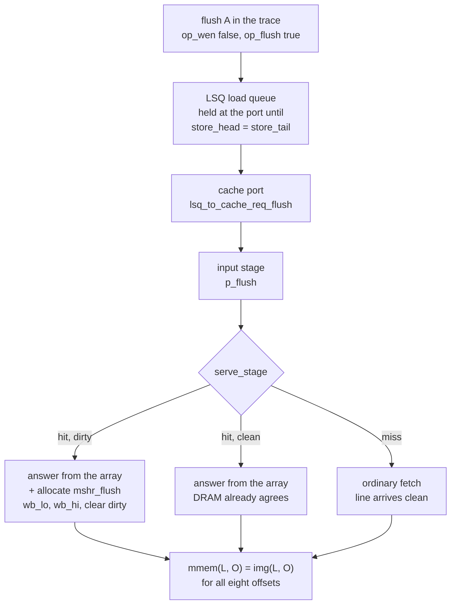

# `flush`: a writeback operation for `circular_queue.ivy`

Proposal only. Nothing implemented.

Scope chosen: **flush is an ordinary LSQ operation** that reaches the cache
through the existing load path, and **the cache writes the named line back to
DRAM**. No squash, no reference unwinding, no new queue.

All line references are to `one_cache/circular_queue.ivy` at 2805 lines.

## Conclusion first

Encode a flush as a **load with a side effect**: `~op_wen`, so the reference
executes it as a read and the whole LSQ theorem applies to it unchanged; plus
one opaque bit on the request port that tells the cache to write the line back.
`img` never moves on a flush, so `img_ctag` (L616-618) is preserved trivially
and `ctag` advances over the flush tag through the ordinary `ld_ans` arm
(L554-560). The flush's response is proved correct by `resp` (L1218-1222)
without `resp` being touched.

The LSQ's queues, its 36 invariants, its ghost monitor and its theorem are
byte-identical. Its **one** flush-specific line is a conjunct on the ready
wire:

```
definition lsq_to_cpu_ready = cpu_ready_r
    & ~(cpu_to_lsq_req_flush & store_head ~= store_tail)   # L729
```

That conjunct is not decoration and zero is not achievable; §2 prices it.

On the cache side the flush is **an eviction that keeps the line**. It joins
`evicting` (L1754-1756), so `issue_wb_0/1` (L1981-1996), `mv_ok_*`,
`ev_victim_*`, `wb_wire_*`, `ev_unowned_*`, `ev_distinct`, `fill_wb0_*` and
`wb_img` all apply to it verbatim; it differs from a real eviction only in its
terminal step, which clears the dirty bit instead of installing a fetched line.
Exactly one cache invariant is weakened (`no_alias_*`), and the memory
controller does not change at all.

## The shape



The three arms converge, and that is the contract: **when a flush completes,
line L is not dirty-resident and no MSHR owns it, so `unowned` (L2225-2236) plus
`mc_owns_img` (L2590) put it in DRAM.** The flush theorem is a corollary of
invariants the file already checks; see §6.

## 0. What the operation is

`flush(A)`: write back the line containing `A`, and return the word at `A`.

Returning the word is forced, not chosen. `~op_wen` makes `trace.step` record
`st(now).rdata` (L341-343), and `resp` then obliges the LSQ to hand that datum
to the cpu. The alternative — a flush that returns nothing — is a store-shaped
entry, and §2 shows that costs four LSQ invariants. A read-and-clean is the op
this machine can carry for free.

The one visible price: **a flush of a non-resident line fetches it**, because
the answer has to come from somewhere. The line arrives clean, so the contract
still holds on that arm; it is a wasted fill, not a wrong result.

## 1. Trace and ports

Two new symbols. `op_wen` stays a free function; nothing becomes a definition.

```
function op_flush(T : tag) : bool        # beside L178-182

import wire cpu_req_flush : bool         # beside L379-381
definition cpu_req_flush = op_flush(trace.nxt) & ~op_wen(trace.nxt)
```

The `& ~op_wen` is what keeps `op_flush` from needing an axiom. A trace op with
both bits set is a store and the flush bit is dropped at the port, so no
`op_flush(T) -> ~op_wen(T)` property has to be stated and no isolate has to
carry it.

`trace`, `abs_memory` and all five trace invariants (L365-372) are untouched: a
flush is a read to the reference, and `tr_step`/`tr_rd` already say what a read
does. Contrast the squash design, which needed exemptions on both.

Wire it through: `cpu_to_lsq_req_flush` in `lsq_body` beside L442-445, connected
at L2787-2790.

## 2. LSQ

### The datapath additions, all opaque

| Where | Addition |
|---|---|
| L442-445 | `wire cpu_to_lsq_req_flush : bool` |
| L454-460 | `wire lsq_to_cache_req_flush : bool` |
| L640-650 | `var load_flush(K : load_idx) : bool` |
| L652-657 | `var req_flush_r : bool` |
| L719-724 | `definition lsq_to_cache_req_flush = req_flush_r` |
| L973-975 | `load_flush(load_tail) := cpu_to_lsq_req_flush` |
| L866-893 | `lfl := load_flush(load_head + d)` in each of the four branches |
| L894-898 | `req_flush_r := lfl` beside `req_idx_r := lidx` |
| L899-924 | `req_flush_r := false` on the store arm |

No loop, no scan: the bit rides the four unrolled branches step 3 already has,
addressed off `load_head + d` like every other array read there (L858-861).
`var lfl : bool := false` is initialised because an uninitialised local has no
net in RTL (L953-956).

`load_flush` needs no clear on slot reuse: step 4 writes it at every accept,
exactly like `load_addr`, and step 3 reads only pending slots.

**No invariant mentions any of it.** The flush bit is to the LSQ what
`req_idx_r` is to the cache: payload that routes and never certifies. §7 step 5
offers to close that if you want the routing checked.

### The one conjunct, and why zero is impossible

Store-to-load forwarding (L952-975) answers a load out of the newest pending
store to the same address. A flush is load-shaped, so **`store x; flush x;` —
the whole point of having a flush — forwards, and the writeback never happens.**

Suppressing the forward is not a one-line fix. It breaks two invariants, and
one of them is a real bug, not bookkeeping:

- `l_gap` (L1088-1091) says an unready pending load aliases no *older* pending
  store, which is precisely "we would have forwarded". A non-forwarded flush
  behind an aliasing store falsifies it directly.
- `l_rdata` (L1096-1097) says an unready load's reference datum is the frontier
  image at its address. With an older pending store to that address it is
  **false**, and the cache would answer the flush with a stale word. Repairing
  it means restating both under `load_elig` (L712-715) and re-establishing them
  at store departure instead of at enqueue — a change to the core of the LSQ
  proof, and the one place the file's own comments (L689-704) say the argument
  is delicate.

So the flush is instead **held at the port until the store queue is empty**:

```
definition lsq_to_cpu_ready = cpu_ready_r
    & ~(cpu_to_lsq_req_flush & store_head ~= store_tail)
```

Everything follows from that:

- The forwarding scan is over *pending* stores, and there are none, so `fhit` is
  false without the scan being edited. **L974 is unchanged.**
- `l_gap`'s hypothesis needs `mark_offset(J) <= (K - load_head)`, i.e. store J
  older than the flush. Stores accepted after the flush have a strictly greater
  `mark_offset`. Vacuous.
- `l_rdata` holds by the ordinary argument: with no pending store, everything
  between `ctag` and the flush's tag is a load, loads preserve memory
  (`tr_step`), and `tr_rd` closes it. Its maintenance is that of any unready
  load, including a younger store departing past it (`dep_ctag`,
  `store_departed_past`).

The accept guards at L583 and L945 both read the `lsq_to_cpu_ready` **wire**, so
neither the ghost monitor nor the datapath is edited and the two stay textually
in agreement (the requirement at L942-944). The guard only gets *stronger*, so
every invariant conditioned on an accept survives, and a stalled edge is the
`~ready` edge the induction already carries (L383-391). `q_rdy` (L990) is stated
over `cpu_ready_r`, and the wire implies the register, so the room argument is
unaffected.

Deadlock-free: the stalled flush occupies no slot, so it blocks nothing that the
store queue's drain depends on.

Narrower alternative, if the over-synchronisation matters: gate on "no pending
store aliases `cpu_to_lsq_req_addr`" instead. Same proof, but it drags a
four-way address compare into the ready wire — the arbitration path — to save a
few cycles per flush. The 3-bit pointer compare is the right default.

### Why the flush sees every older store

At the flush's accept, `store_head = store_tail`, so by `s_range` (L998-999)
every older store has already handshaken with the cache. A store that handshook
is in the cache's stage, and `rdy_drain` (L1507) says an advertised
`creq_ready` — which the flush's own handshake needs — drains it that same edge.
The flush is latched into the stage on that edge (L2168-2173) and serves the
next one, by which time the store is in the array or in an MSHR.

If it went into an MSHR, the flush stalls in the stage on `stage_movable`'s
alias check (L1782-1783) until `do_fill` installs the line dirty, and then hits.
**Every older store to the flushed line is in the array before the writeback is
read.** No new mechanism; the existing gate does it.

Younger stores split cleanly: same word, and `store_elig` (L705-711) holds the
store behind the unanswered flush; different word in the same line, and the
store either lands before the flush serves — shipped in the writeback, which is
harmless because the beat carries `img` either way (`wb_img`) — or stalls on
`~evicting`.

## 3. Cache

One new `mstate`. `mstate` is `bv[3]` (L74) with 0-4 used (L1589-1593), so
`mshr_flush = 5` fits with **no width change**.

A slot in `mshr_flush` is an eviction of its own base:

| Field | Value at allocation | Why |
|---|---|---|
| `m_base` | the flushed line `h` | `issue_wb_*` and `ev_victim_*`/`mv_ok_*` are indexed by `hash(m_base)` |
| `m_victim_way` | the hitting way | `mv_ok_*`: `mvline = ltag(hash(m_base), victim_way)` |
| `mvline` | `h` | same |
| `m_dphase` | `dp_wb_lo` | enters `evicting` immediately |
| `m_dirty` | **`true`** | see below |
| `m_wb0` | `false` | no beat has landed |
| `rq_valid` | `false` | the answer is given at once; `ev_empty_*` needs this |

`m_dirty := true` is the single most load-bearing choice here. It is *true* —
the MSHR's line is newer than memory for the duration — and it is what keeps
`mshr_mem_*` (L2430-2437) unweakened: with `~m_dirty` the invariant would demand
`mmem(L, O) = img(L, O)` from the allocation edge, which is exactly false while
the line sits dirty in the array.

### Datapath edits

| Site | Edit |
|---|---|
| L1754-1756 | `evicting(Id)` state test becomes `(m_state(Id) = mshr_drain \| m_state(Id) = mshr_flush)` |
| L1814-1815, L2108/L2111, L2154-2155, L2184-2185, L1929-1931, L1959-1961 | ten written-out copies of `evicting` over six sites, each gaining the same disjunct |
| L1669-1675 | `var p_flush : bool`, latched at intake (L2168-2173) |
| L2037-2047 | flush hit: answer as now, then allocate the flush MSHR if `p_flush & tag_dty(cidx(rs, hway))` |
| L2122-2130 | the four writeback arms test `(s0_m_state = mshr_drain \| s0_m_state = mshr_flush)` |
| L1919/L1951 | `drain0`/`drain1` gain a self-guarded flush arm |
| L2159-2162 | the arbiter's middle test becomes `s0_m_state = mshr_drain \| s0_m_state = mshr_flush` |

The allocation, in the `~wen` arm of `serve_stage`'s hit branch:

```
if p_flush & tag_dty(hw_cidx(rs, hway)) {
    if s0_m_state = mshr_idle {
        s0_m_state := mshr_flush;   s0_m_base := h;
        s0_m_dirty := true;         s0_rq_valid := false;
        s0_m_dphase := dp_wb_lo;    s0_m_victim_way := hway;
        s0_mvline := h;             s0_m_wb0 := false;
    } else { ... the same for s1 ... };
};
```

The else-chain closes by construction: the gate (L1785) guarantees an idle slot,
the same argument the existing allocate path uses (L2014-2017). The answer and
the allocation write disjoint state, so the response port keeps one writer.

And the terminal step, reached from `drain0`/`drain1` when the phase has
advanced to `dp_fill`:

```
action flush_done_0 = {
    tag_dty(hw_cidx(hw_hash(s0_m_base), s0_m_victim_way)) := false;
    s0_m_state := mshr_idle;
}
```

`tag_occ`, `tag_ln`, `dat0`, `dat1` and `set_lru` are untouched: this is `clwb`,
not `clflush`. The line stays resident and a following load still hits, `c_img`
(L2362) is undisturbed, and it is strictly less machinery than `do_fill`.

`dp_fill` is reused as the flush's terminal phase rather than a fifth `dphase`
value, because `dphase` is `bv[2]` with all four values taken (L1594-1597) and
because it keeps `evicting` and `fill_wb0_*` one formula each. For a flush slot
read it as "both beats issued, retire on the next arbiter turn".

Miss and clean-hit arms take the existing paths unedited; `p_flush` is simply
not read there. On a miss the fetched line is installed clean
(`fetch_clean_*` L2313-2314, then `do_fill`'s `tag_dty := m_dirty`), so DRAM
still holds it.

### At most one flush, and no flush beside an allocation

`stage_movable` requires `~evicting(0) & ~evicting(1)` (L1784), and a flush MSHR
is `evicting` from its allocation edge. So `serve_stage` cannot run — and hence
no second flush and no new fetch can be allocated — until the flush retires. The
one concurrency that remains is a flush beside an MSHR that was already fetching
and later drains, which is what `ev_distinct` (L2327) and the victim-avoidance
in `drain0`/`drain1` (L1929-1934, L1959-1964) already handle, now that
`evicting` covers the flush slot.

That is also the reason the flush slot **must** join `evicting` rather than
carry a parallel notion: without it another MSHR could pick the flushed line as
its own victim, or `do_fill` could overwrite the line between beat 0 and beat 1.

## 4. Memory controller

Nothing. A flush's writeback is an ordinary write command; `mc_owns_img`
(L2590), `mc_resp` (L2606) and `rdy_idle` (L2618) are untouched, and so is the
command buffer. Compare the squash design, which had to cancel buffered reads.

`cachemem`'s monitor is untouched too, and that is where the theorem comes from:
`cache_owns` is set only at a store drain (L1402-1412) — gated off while
`evicting` — and cleared exactly at a landing write beat (L1376-1381). The
flush's two beats are landing write beats. `img` does not move, because
`stage_store` is latched only on `lsq_to_cache_req_wen` (L1416-1423) and a flush
has `~wen`; `stage_sync` (L2293) therefore needs no flush case.

`lsq_to_cache_req_flush` is declared at the `cachemem` level as a pass-through
(a module may only name its own wires and its children's, L1278-1281) and
connected at L2703-2708 and L2770-2775.

## 5. Why the cache invariants survive

Exactly one is weakened:

| Line | Invariant | Edit |
|---|---|---|
| 2263-2266 | `no_alias_*` | add `& m_state(Id) ~= mshr_flush` to the hypothesis |
| 2243-2246 | `fill_wb0_*` | restate over `evicting(Id) & m_dphase(Id) = dp_fill` (same formula, extended by the new state) |

`no_alias_*` says an active MSHR's base is not resident, and a flush MSHR's base
*is* resident — that is the whole idea. The weakening is safe because both
consumers are about fetching slots: the capture chain that derives
`~cache_owns(m_base, O)` (the note at L2259-2261) and the array/fill-buffer
separation behind `fbuf_img_*`, whose `fb_lo`/`fb_hi` guards (L2376-2381)
enumerate states and so exclude `mshr_flush` on their own.

Everything else holds as written:

- `fetching`, `fb_lo`, `fb_hi` enumerate states → `fetch_clean_*`, `fbuf_img_*`
  vacuous for a flush slot.
- `mshr_mem_*` vacuous by `m_dirty`.
- `unowned`: its MSHR disjunct fails for the flushed line while `m_dirty` — the
  line *is* owned — and its residency conjunct is false anyway while the line is
  dirty-resident. Nothing to prove until retirement.
- `ev_victim_*`, `mv_ok_*`: the flush allocates only on a dirty hit, and nothing
  can disturb that entry while the gate is shut.
- `ev_empty_*`: `rq_valid` is false and stays false — `serve_stage`'s enqueue
  arms need an aliasing active MSHR, which the gate excludes.
- `slot_img_*`, `slot_active_*`, `c_img`, `c_set`, `c_ways`, `stage_sync`:
  untouched state.
- `wb_wire_*`, `ev_unowned_*`, `wb_wire_hi_*`: extended by `evicting`, and their
  arguments are the eviction's, unchanged — entering `dp_fill` needs `cmd_ready`
  for the high beat, and `rdy_idle` then says the low beat had already landed.
- `capture` (L2078-2097) matches neither `mshr_flush`, so a stray fill cannot
  disturb the slot; the controller never answers a write, so none arrives.

## 6. The theorem this buys

Take the retirement edge N, where `flush_done_0` clears the dirty bit and beat 1
is on the wire.

1. `c_ways` (L2275) and `c_set` (L2274): line L lives in that one way, so "no
   way holds L dirty" — `unowned`'s first conjunct at `H = L` — is now true.
2. The MSHR conjuncts hold: the flush slot is idle, and the other slot's base is
   `~= L` by `mshr_distinct` (L2268), preserved because no allocation can happen
   under the shut gate.
3. `unowned`'s wire conjunct is false for beat-1 offsets, so nothing is demanded
   there yet; for beat-0 offsets it is true, and `ev_unowned_0` (L2254) supplies
   `~cache_owns(L, O)` off `m_wb0`, which `fill_wb0_0` guarantees on entry to
   `dp_fill`.
4. One edge later the high beat lands: `mc_body`'s monitor writes `mmem`
   (L2558-2568) and `cachemem`'s clears `cache_owns` (L1376-1381), so `unowned`
   now yields `~cache_owns(L, O)` for every O.
5. `mc_owns_img` (L2590) turns that into `mmem(L, O) = img(L, O)`, and the datum
   is right because the beats carried `img` (`wb_img`, L1529).
6. `img_ctag` (L616-618), one level up, makes it the *reference* image.

So: **one edge after a flush retires, DRAM holds the reference image of the
flushed line.** No new invariant is required for this; the only new proof
obligation is that the invariants above stay inductive across three transitions
— allocate, issue, retire — that are structurally the eviction's.

The other two arms are one step each: a clean hit and a post-fill line are
un-owned by `unowned` directly, so `mc_owns_img` already puts them in DRAM.

## 7. Verification

```
cd one_cache
/home/anthonydu/memory_sys_verif/ivy/venv/bin/ivy_check circular_queue.ivy
```

Watch for divergence as much as for failure — the `ref_tag_lsq.ivy` baseline is
about 30s. Five steps, each independently checkable:

1. `op_flush`, `cpu_req_flush`, the wires, `load_flush`, `req_flush_r`. Pure
   payload; must reproduce the baseline result and roughly the baseline time.
   Any slowdown here means the bit leaked into a query context it should not be
   in.
2. The `lsq_to_cpu_ready` conjunct. Strictly stronger accept guard, so every
   `lsq_body` goal should close unchanged. If one does not, an invariant is
   relying on accepts happening, which would be news.
3. `mshr_flush`, `evicting`, the written-out copies, the arbiter and issue
   arms — no allocation yet, so the state is unreachable. This isolates the
   `evicting` extension: `cache_body`'s goals must be unchanged.
4. The allocation and `flush_done_*`. The real work. Expect `no_alias_*` to fail
   first if the weakening was missed, `mshr_mem_*` if `m_dirty` was left false,
   and `ev_victim_*`/`mv_ok_*` if the victim way is not the hitting way.
5. *Optional, and the honest close:* tie the bit to the trace, by adding
   `& op_flush(ltag(K)) = load_flush(K)` to `l_kind` (L1013) and
   `& req_flush_r = op_flush(ltag(req_idx_r))` to `pres_l` (L1142). Both are
   written beside facts of the same shape and are inductive by the same
   assignments. This is the only part of §2 that touches an LSQ invariant, and
   it is what makes "the trace said flush" imply "the cache ran a flush".

Then the RTL smoke test:

```
./run_circular_queue.sh -o flush.ops
```

`ivy_to_rtl` needs a new port on `mem_subsys` and `testbench.sv` needs an `f`
op kind beside `r`/`w`/`n` (L187-214), driving `cpu_req_flush` beside
`cpu_req_wen` (L283-286). Scoring is a read's — push `ref_mem[addr]` onto
`exp_data_q` (L378-382) — plus one flush-specific check: after a drain window,
`dram[base | j] === ref_mem[base | j]` for the eight words of the line, off the
`dram` model the writeback observer already maintains (L392-400).

The stall needs no testbench change: it lowers `cpu_ready`, and the driver
already holds an op when `cpu_ready` is low (L369-390).

Cases worth having in `flush.ops`:

- `w 02 …` then `f 02` — the forwarding case. Without the ready conjunct this
  one silently does nothing, and the DRAM check catches it.
- `f 00` on a clean resident line, and `f 00` on a line never touched — the two
  no-writeback arms; assert `n_wb` does not move.
- a flush of a line while the other MSHR is fetching — `ev_distinct` and the
  victim avoidance.
- `f 40` with set 0 already four-deep from section D of `smoke.ops` — a flush
  whose line is the pending victim of a real eviction.

## What this does not prove

- **§6 is a derivation, not a checked invariant.** Every ingredient is checked,
  but nothing in the file states the composition, because stating it needs
  "line L is nowhere dirty-resident" for a quantified L — the
  `ltag(hash(H), W) = H` shape `ivy_check` rejects outright (the notes at L1256-
  1270 and L2344-2357). The address-indexed form is what `unowned` already is,
  so the composition is available to a reader and to any future goal written
  over `A : addr`; it is not available as a one-line theorem.

- **Without step 5, the flush bit's routing is unchecked.** `ivy_check` passes
  on an LSQ that drives `lsq_to_cache_req_flush` low always. The mechanism is
  verified; the decode is not. This is a much narrower gap than the squash
  design's — there, the entire cache and controller behaviour was unconstrained
  — but it is a gap, and step 5 closes it for two conjuncts.

- **The stall is stronger than the architecture needs.** A flush waits for every
  older store, not just those to its own line. Correct, cheap, and more
  synchronising than `clwb`; the narrow alternative in §2 is available at the
  cost of an address compare in the ready path.

- **A flush of a non-resident line fetches it.** Forced by `resp`: the LSQ
  proves the flush returns `st(cpu_tag_r).rdata`, so the word has to be
  produced. A flush that returned nothing would be a store-shaped entry, which
  costs `s_kind`, `pres_mem`, the `st_go` arm of the ghost monitor and the stage
  latch — four LSQ changes to save one fill.

- **Liveness is unchanged in kind, not in argument.** The flush adds a stall at
  the port and up to three edges of `evicting` backpressure. Neither can block
  the drains that clear them, so the deadlock argument at L2142-2144 carries;
  `lsq_liveness.md` has not been re-read against it.
